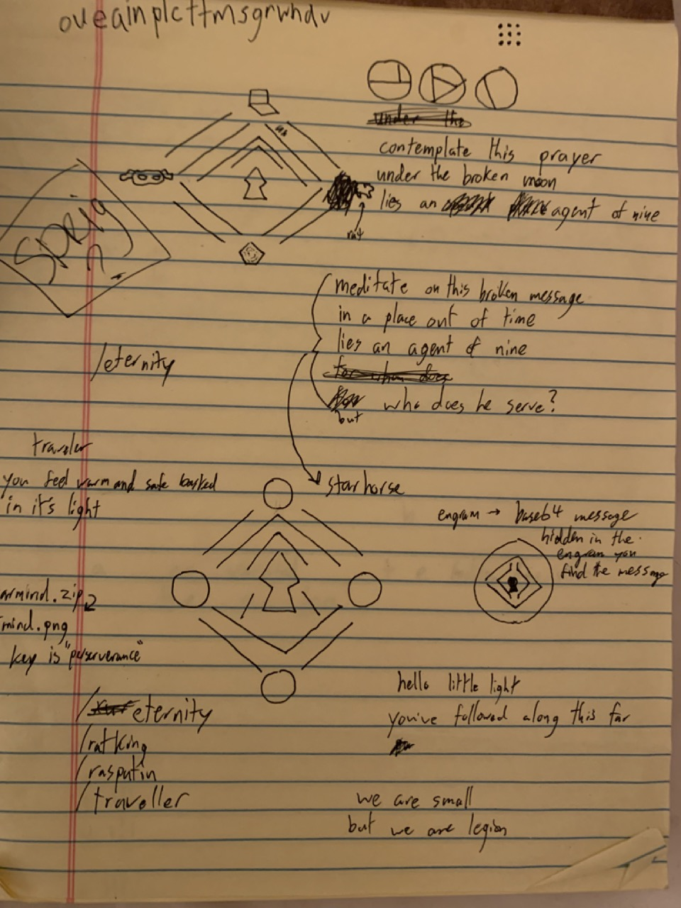
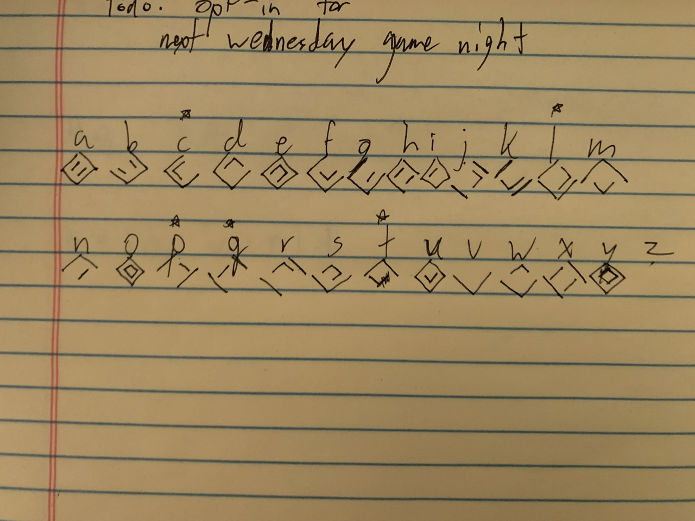

# Puzzle for AMA with Justin

Initial notes:

Puzzle steps:

1. a new user in slack shows up with the name ghost & a destiny ghost as the profile pick
2. it posts the image of a dinosaur sleeping on an engram (https://www.destinypedia.com/Engram)
3. the exif info of the image says "how will you decrypt it?"
4. the png has endbytes that give a link to the treasure hunt URL
5. Hunters start out by going to the treasure hunt page (the index of this site) and seeing a glyph similar to the warmind dlc logo with 4 symbols. each symbol is am emblem of a specific page
   - rasputin logo
   - engram
   - traveler
   - rat
(these can be solved in any order)
6. Hunters go through the puzzle steps in any order
    1. ratking.html is solved by going to the page and reading the inscryption it's something like "-- --- small, --- --- are legion" in barcode lang
    2. rasputin.html links to a .zip file
        - from there, hunters rename the .zip file to a .png
        - the image is barcode lang for "a great warmind of the golden age stirs in hellas basin", with regular english mixed in
    3. ghost.html
        - barcode for "little light"
    4. traveler.html
        - base 64 text for the message "the traveler; the gardener", but the last 2 equals signs in the string are replaced with the same message in barcode lang
7. once each hint is decoded, the barcode message on index.html can be decoded. it reads:
   > contemplate this broken thought
   > in a place out of time
   > lies an agent of nine
   > but who does he serve?
8. xur is the agent, and in the map _eternity_ he serves "starhorse"
9. on "starhorse.html" is a black hole in the background looping with a message above
    > you've traveled far little light
    > and we're impressed
    > we hope you join us to chat with the creator of this world
    > and maybe, if you show up with, our presence will be known

questions?

- maybe post this from @vera
- leak some images

---

Intent:

Why am I doing this?

- the best AMAs have inspired questions
- it feels like many people show up day of & maybe questions will be more inspired if people are feeling inspired about the person's work
- lore gets people interested
- learning about cool stuff gets people interested
- making a quiz or kahoot feels forced & like homework– need to get people to dip their toes in as much or as little as they want
  - this also means each puzzle should be non-destiny/bungie specific. domain specific knowledge helps, but everyone's background is a technical one, not a game one
- puzzle should drum up activity in the slack